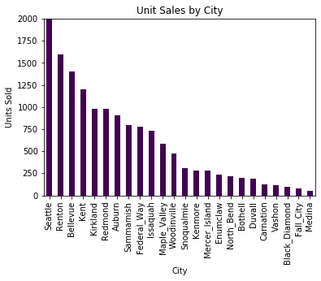
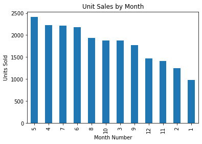

## Introduction

The King County Housing Data Set is a familiar dataset to the Data Science enthusiast. It contains data on home sales in the King County, Washington (around the Seattle area).

The goal of this project is two-fold: 

Goal 1: to optimize a model that will predict the price of a home based on information provided.

Goal 2: to create and answer questions that a potential investor new to that region may have to determine whether to invest in that area.

## The Dataset

- id - unique identified for a house
- dateDate - house was sold
- price - is prediction target
- bedroomsNumber - of Bedrooms/House
- bathroomsNumber - of bathrooms/bedrooms
- sqft_livingsquare - footage of the home
- sqft_lotsquare - footage of the lot
- floorsTotal - floors (levels) in house
- waterfront - House which has a view to a waterfront
- view - Has been viewed
- condition - How good the condition is ( Overall )
- grade - overall grade given to the housing unit, based on King County grading system
- sqft_above - square footage of house apart from basement
- sqft_basement - square footage of the basement
- yr_built - Built Year
- yr_renovated - Year when house was renovated
- zipcode - zip
- lat - Latitude coordinate
- long - Longitude coordinate
- sqft_living15 - The square footage of interior housing living space for the nearest 15 neighbors
- sqft_lot15 - The square footage of the land lots of the nearest 15 neighbors

## Conclusions

After performing quite a bit of data manipulation, feature engineering and other preprocessing techniques, we were able to get our final model to reach an accuracy of near 75% of price. This model was validated through a MSE test on training and test data.

Three additional questions were asked that may benefit a real estate investor looking in that area. 

1. What are the top three features that attribute to price?
The number of floors attributed most to price.
2. Is there any findings on location of home that is valuable to an investor?
A bar chart and heatmap were created to show unit sales locations.

3. Is there any findings on time of year that is valuable to an investor? 
April-July seem to be the top 4 months for sales in the region according to our visual.

